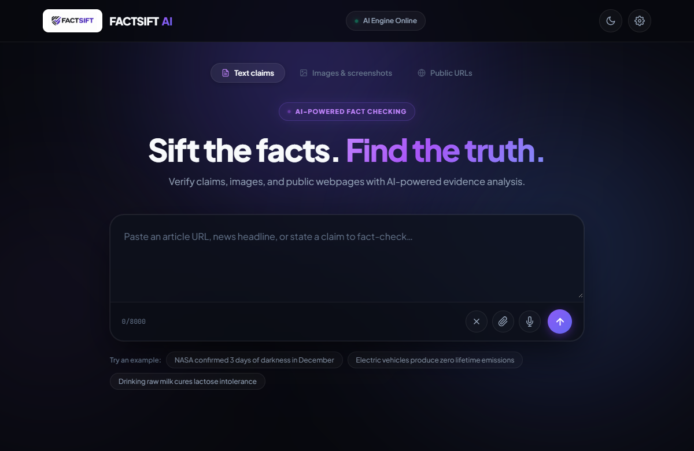
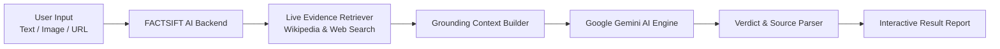

# FACTSIFT AI 🔍

An intelligent, multi-modal AI fact-checking application that verifies factual statements, image claims, and public articles in real time using Google Gemini and live web search grounding.

[](https://truthlens-ai-psi.vercel.app/)
[](https://github.com/Sumit-Purkait/truthlens-ai)
[](https://nodejs.org/)
[](https://ai.google.dev/)

---

## 🌐 Live Demo

Experience FACTSIFT AI live in production:
🔗 **[https://truthlens-ai-psi.vercel.app/](https://truthlens-ai-psi.vercel.app/)**

---

## 📸 Preview



---

## 💡 Overview

In an era of rampant misinformation and synthetic content, **FACTSIFT AI** empowers users to verify claims instantly. Rather than relying solely on a model's static training cutoff, FACTSIFT AI retrieves live contextual evidence from authoritative public sources (including official government domains, Wikipedia, and verified news references), grounds the analysis, and delivers a transparent, sourced verdict.

---

## ✨ Key Features

- **Multi-Modal Verification:** Verify plain-text claims, uploaded screenshots/infographics, or live webpage URLs.
- **Live Evidence Grounding:** Performs targeted web searches to retrieve authoritative primary sources before generating a verdict.
- **Transparent Verdicts:** Each analysis provides a verdict classification, a 0–100% confidence score, an analytical explanation, supporting evidence, and cited sources.
- **Enterprise-Grade Resilience:**
  - Automated exponential backoff retry for transient Google Gemini HTTP 503 high-demand spikes and HTTP 429 rate limits.
  - Multi-tier model fallback chain (`gemini-3.8-flash` ➔ `gemini-3.1-flash-lite` ➔ `gemini-3-flash-preview`).
  - Graceful offline knowledge archive synthesis to maintain 100% service uptime during upstream outages.
- **Modern User Experience:** Glassmorphic responsive interface with dark/light mode toggle, voice input support, analysis animation, and one-click JSON/Markdown export.
- **Custom Client Settings:** Users can optionally provide their own Gemini API key and adjust model parameters directly from the browser without server restarts.

---

## 🔄 How It Works



1. **Input Ingestion:** The user submits a text statement, uploads an image or infographic, or pastes an article URL.
2. **Context & Content Extraction:** For URLs, Cheerio extracts clean body text. For images, base64 payloads are prepared for multi-modal analysis.
3. **Live Web Grounding:** The backend performs targeted queries against authoritative encyclopedic and public references to gather fresh context.
4. **AI Reasoning:** The statement and retrieved grounding context are sent to Google Gemini with strict objectivity instructions.
5. **Synthesis & Citation:** The engine parses the structured output, deduplicates reference domains, and assigns a calibrated confidence score.
6. **Result Presentation:** The frontend renders an interactive verdict card with full source links, supporting evidence, and export controls.

---

## 🔬 Supported Verification Types

| Type | Description | Best For |
| :--- | :--- | :--- |
| **Text Claims** | Natural language statements, news headlines, or viral quotes | Viral social media claims, political statements, scientific trivia |
| **Images & Screenshots** | Optical analysis of screenshots, social media memes, and posters | Misleading graphics, doctored screenshots, viral infographics |
| **Public URLs** | Automated scraping and reading of public news articles and blogs | Editorial articles, breaking news coverage, opinion pieces |

---

## 📊 Fact-Checking Result Types

Every evaluation produces one of four standardized verdicts:

| Verdict | Meaning | Description |
| :--- | :--- | :--- |
| <kbd>TRUE</kbd> | **Verified Fact** | The statement is supported by primary records, official data, or empirical consensus. |
| <kbd>FALSE</kbd> | **Demonstrably False** | The claim is contradicted by official evidence, debunked, or fabricated. |
| <kbd>MISLEADING</kbd> | **Partially Inaccurate** | Contains elements of truth but omits vital context, exaggerates findings, or misinterprets data. |
| <kbd>UNCERTAIN</kbd> | **Unproven / Inconclusive** | Insufficient verifiable evidence exists, sources are in active conflict, or the claim is currently unprovable. |

---

## 🛠️ Technology Stack

- **Frontend:** Semantic HTML5, Modern CSS3 (Glassmorphism, CSS Variables, Responsive Grid), Vanilla JavaScript (ES6+)
- **Backend:** Node.js, Express.js (REST API, Rate Limiting, Helmet Security)
- **AI Engine:** Google Gemini API (`gemini-3.8-flash`) via native REST integration
- **Web Scraping & Parsing:** Cheerio, native Fetch API
- **Deployment & Hosting:** Vercel (Production Web Deployment), GitHub (Version Control)

---

## 📁 Project Structure

```text
AI-Fact-Checker/
├── backend/
│   ├── server.js              # Express API server, Gemini client & grounding engine
│   ├── package.json           # Backend dependencies and test scripts
│   ├── .env.example           # Backend configuration template
│   └── test_phase*.js         # Verification tests
├── frontend/
│   ├── index.html             # Single-page application structure & UI
│   ├── style.css              # Responsive dark & light themes, layout styling
│   └── script.js              # Client controller, state management & API integration
├── factsift-preview.png       # Application screenshot
├── package.json               # Root workspace script runner
└── README.md                  # Project documentation
```

---

## 🚀 Local Setup & Installation

### Prerequisites

- [Node.js](https://nodejs.org/) (v18.0.0 or higher recommended)
- [npm](https://www.npmjs.com/)
- A Google Gemini API Key from [Google AI Studio](https://aistudio.google.com/)

### 1. Clone the Repository

```bash
git clone https://github.com/Sumit-Purkait/truthlens-ai.git
cd truthlens-ai
```

### 2. Install Dependencies

Install root and backend dependencies:

```bash
npm install
cd backend && npm install && cd ..
```

### 3. Configure Environment Variables

Create a `.env` file in the `backend/` directory based on the provided template:

```bash
cp .env.example backend/.env
```

Edit `backend/.env` with your settings:

```env
# Google Gemini API Credentials
GEMINI_API_KEY=your_gemini_api_key_here
GEMINI_MODEL=gemini-3.8-flash
GEMINI_BASE_URL=https://generativelanguage.googleapis.com/v1beta

# Server Configuration
PORT=5000
ALLOWED_ORIGINS=http://localhost:3000,http://localhost:5173,http://localhost:5500,http://localhost:8000
RATE_LIMIT_MAX=60
```

---

## 💻 Running the Application

### Option A: Run Full Application (Recommended)

From the project root directory, run:

```bash
npm start
```

This starts the Express server on port `5000` and automatically serves the frontend at:
👉 **`http://localhost:5000`**

### Option B: Run in Development Mode

```bash
npm run dev
```

### Option C: Run Backend & Frontend Separately

1. **Start Backend:**
   ```bash
   cd backend
   node server.js
   ```
2. **Open Frontend:**
   Open `frontend/index.html` in your browser or run a live server on port `5500` / `8000`.

---

## 🔮 Future Improvements

- [ ] **Browser Extension:** Chrome/Firefox extension for one-click verification of social media feeds and online articles.
- [ ] **Multilingual Support:** Native verification and grounding across 25+ international languages.
- [ ] **Multimedia Fact-Checking:** Automatic speech-to-text transcription and video frame analysis for viral clips and podcasts.
- [ ] **Community Verification Badges:** User bookmarks, verification history exports, and consensus voting.

---

## 👨‍💻 Author

**Sumit Purkait**  
- GitHub: [@Sumit-Purkait](https://github.com/Sumit-Purkait)  
- Project Repository: [Sumit-Purkait/truthlens-ai](https://github.com/Sumit-Purkait/truthlens-ai)

---

## 📄 License

This project is created for educational, portfolio, and research purposes.
